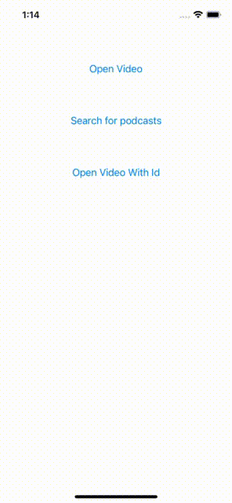

# YPlayer

Youtube player is to run and play youtube videos using webview, it will show webview as native component, so you can do many things, like seeking time, get current time, play video with options, etc..

### Add Pod   
```sh
pod 'YPlayer'
import YPlayer
```

## Requerments
Add to info plist
```sh
    <key>NSAppTransportSecurity</key>
        <dict>
        <key>NSAllowsArbitraryLoads</key>
        <true/>
    </dict>
```

## Open youtube video with id




```sh
    let vc = YPlayerWebViewViewController.initPlayer(delegate: self)
    let videoPresenetation = VideoPlayerPresentaion(videoId: "668nUCeBHyY")
    self.present(vc, animated: true) {
        vc.openPageWithVideoId(presentation: videoPresenetation)
    }
```
 ##### Always you can add many options to the presentation struct
 - let videoId: String
 - var autoplay = 1
 - var controls = 1 // show video controls options
 - var color: PlayerColor = .red
 - var playsinline = 1
 - var start: Float = 0.0 // start time
 - var loop = 0
 - var rel = 0 // show related videos after video end
 - var fs = 1 // show full screen option
 - var modestbranding = 0 // show youtube colors
 
## Open youtube with searched text


```sh
    let vc = YPlayerWebViewViewController.initPlayer(delegate: nil)
    vc.webviewType = .searching
    self.present(vc, animated: true) {
        var c = URLComponents(string: "https://www.youtube.com/results")
        c?.queryItems = [
            URLQueryItem(name: "search_query", value: text)
        ]
        guard let url = c?.url else { return print("url fail") }
        vc.openPage(url: url)
    }
```
## Features
```sh
    func getCurrentTime(handler: @escaping (Float?) -> Void)
    func seekTo(time: Float)
    func mute()
    func unMute()
    func isMuted(handler: @escaping (Bool?) -> Void)
    func setVolume(volume: Int)
    func getVolume(handler: @escaping (Int?) -> Void)
    func setPlaybackRate(value: Float)
    func getPlaybackRate(handler: @escaping (Float?) -> Void)
    func getAvailablePlaybackRates(handler: @escaping ([Float]?) -> Void)
    func setLoop(value: Float)
    func setShuffle(value: Float)
    func getVideoLoadedFraction(handler: @escaping (Float?) -> Void)
    func getPlayerState(handler: @escaping (PlayerState) -> Void)
    func getDuration(handler: @escaping (Float?) -> Void)
    func getVideoEmbedCode(handler: @escaping (Float?) -> Void)
    func playVideo()
    func stopVideo()
    func pauseVideo()
    func getIframe()
```
    
    
# for referance https://developers.google.com/youtube/iframe_api_reference
